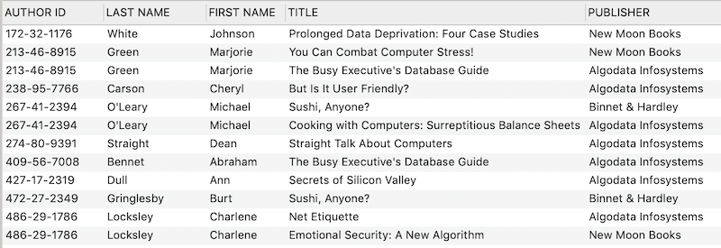

# Lab | Advanced PostgreSQL

## Introduction

In this lab you will practice a lot of PostgreSQL queries. **We use the [publications database](https://s3-eu-west-1.amazonaws.com/ih-materials/uploads/data-static/data/module-1/publications.sql.zip) used in the *Subqueries and Temp tables* lesson.**

Create a `solutions.sql` file to record your solutions to all challenges.

## Challenge 1 - Who Have Published What At Where?

In this challenge you will write a PostgreSQL `SELECT` query that joins various tables to figure out what titles each author has published at which publishers. Your output should have at least the following columns:

* `AUTHOR ID` - the ID of the author
* `LAST NAME` - author last name
* `FIRST NAME` - author first name
* `TITLE` - name of the published title
* `PUBLISHER` - name of the publisher where the title was published

Your output will look something like below:



*Note: the screenshot above is not the complete output.*

If your query is correct, the total rows in your output should be the same as the total number of records in Table `titleauthor`.

## Challenge 2 - Who Have Published How Many At Where?

Elevating from your solution in Challenge 1, query how many titles each author has published at each publisher. Your output should look something like below:


*Note: the screenshot above is not the complete output.*

To check if your output is correct, sum up the `TITLE COUNT` column. The sum number should be the same as the total number of records in Table `titleauthor`.

## Challenge 3 - Best Selling Authors

Who are the top 3 authors who have sold the highest number of titles? Write a query to find out.

Requirements:

* Your output should have the following columns:
	* `AUTHOR ID` - the ID of the author
	* `LAST NAME` - author last name
	* `FIRST NAME` - author first name
	* `TOTAL` - total number of titles sold from this author
* Your output should be ordered based on `TOTAL` from high to low.
* Only output the top 3 best selling authors.

## Challenge 4 - Best Selling Authors Ranking

Now modify your solution in Challenge 3 so that the output will display all 23 authors instead of the top 3. Note that the authors who have sold 0 titles should also appear in your output (ideally display `0` instead of `NULL` as the `TOTAL`). Also order your results based on `TOTAL` from high to low.

## Challenge 5 - Most Profiting Authors

Authors earn money from their book sales in two ways: advance and royalties. An advance is the money that the publisher pays the author before the book comes out. The royalties the author will receive is typically a percentage of the entire book sales. The total profit an author receives by publishing a book is the sum of the advance and the royalties.

Given the information above, who are the 3 most profiting authors and how much royalties each of them have received? Write a query to find out.

Requirements:

* Your output should have the following columns:
	* `AUTHOR ID` - the ID of the author
	* `LAST NAME` - author last name
	* `FIRST NAME` - author first name
	* `PROFIT` - total profit the author has received combining the advance and royalties
* Your output should be ordered from higher `PROFIT` values to lower values.
* Only output the top 3 most profiting authors.

*Hints:* 

* If a title has multiple authors, how they split the royalties can be found in the `royaltyper` column of the `titleauthor` table.
* We assume the coauthors will split the advance in the same way as the royalties.

In order to solve this problem, it is important for you to keep the following points in mind:

* In table `sales`, a title can appear several times. The royalties need to be calculated for each sale.

* Despite a title can have multiple `sales` records, the advance must be calculated only once for each title.

* In your eventual solution, you need to sum up the following profits for each individual author:
    * All advances which is calculated exactly once for each title.
    * All royalties in each sale.

Therefore, you will not be able to achieve the goal with a single SELECT query. Instead, you will need to follow several steps in order to achieve the eventual solution. Below is an overview of the steps:

1. Calculate the royalty of each sale for each author.

1. Using the output from Step 1 as a temp table, aggregate the total royalties for each title for each author.

1. Using the output from Step 2 as a temp table, calculate the total profits of each author by aggregating the advances and total royalties of each title.

Below we'll guide you through each step. In your `solutions.sql`, please include the SELECT queries of each step so that your TA can review your problem-solving process.

### Step 1: Calculate the royalties of each sales for each author

Write a SELECT query to obtain the following output:

* Title ID
* Author ID
* Royalty of each sale for each author
    * The formular is:
        ```
        sales_royalty = titles.price * sales.qty * titles.royalty / 100 * titleauthor.royaltyper / 100
        ```
    * Note that `titles.royalty` and `titleauthor.royaltyper` are divided by 100 respectively because they are percentage numbers instead of floats.

In the output of this step, each title may appear more than once for each author. This is because a title can have more than one sales.

### Step 2: Aggregate the total royalties for each title for each author

Using the output from Step 1, write a query to obtain the following output:

* Title ID
* Author ID
* Aggregated royalties of each title for each author
    * Hint: use the *SUM* subquery and group by both `au_id` and `title_id`

In the output of this step, each title should appear only once for each author.

### Step 3: Calculate the total profits of each author

Now that each title has exactly one row for each author where the advance and royalties are available, we are ready to obtain the eventual output. Using the output from Step 2, write a query to obtain the following output:

* Author ID
* Profits of each author by aggregating the advance and total royalties of each title

Sort the output based on a total profits from high to low, and limit the number of rows to 3.

## Challenge 6 - Alternative Solution

In the previous challenge, you may have developed your solution in either of the following ways:

* Derived tables (Subqueries)
* Creating PosgreSQL temporary tables in the initial steps, and query the temporary tables in the subsequent steps.

Either way you have used, we'd like you to try the other way. Include your alternative solution in `solutions.sql`.

### Additional Learning

In the context of this lab, you may use either the derived table or the temp table way to develop the solution. You may feel the former is more convenient than the latter way. However, you need to know each way is suitable in certain contexts. Derived tables are kept in the PostgreSQL runtime memory and will be lost once the query execution is completed. In contrast, temp tables are physically -- though temporarily -- stored in PostgreSQL. As long as your user session is not expired, you can access the data in the temp tables readily. 

If the data in your database are changing frequently, each time when you use derived tables to retrieve information, you may find the results are different. In contrast, once the temp tables are created, the data stored in the temp tables are persistent. Even if the relevant data in your database have changed, the data in the temp tables will remain the same unless you have updated the temp data. Therefore, if you care about the timeliness of the results, you should use derived tables so that you will always receive the latest information.

However, if your data are massive and queries are complicated, you receive signficiant performance benefits by using temp tables. Because when you use temp tables, the time-consuming calculations (which we call expensive database transactions) are only performed once and the results are persistent. When you query the temp tables repeatedly, you will not perform expensive transactions again and again in your database.

## Challenge 7

Elevating from your solution in Challenge 5 & 6, create a permanent table named `most_profiting_authors` to hold the data about the most profiting authors. The table should have 2 columns:

* `au_id` - Author ID
* `profits` - The profits of the author aggregating the advances and royalties

Include your solution in `solutions.sql`.

### Additional Learning

To balance the performance of database transactions and the timeliness of the data, software/data engineers often schedule automatic scripts to query the data periodically and save the results in persistent summary tables. Then when needed they retrieve the data from the summary tables instead of performing the expensive database transactions again and again. In this way, the results will be a little outdated but the data we want can be instantly retrieved.

## References

[Which one have better performance : Derived Tables or Temporary Tables](https://stackoverflow.com/questions/2326395/which-one-have-better-performance-derived-tables-or-temporary-tables)